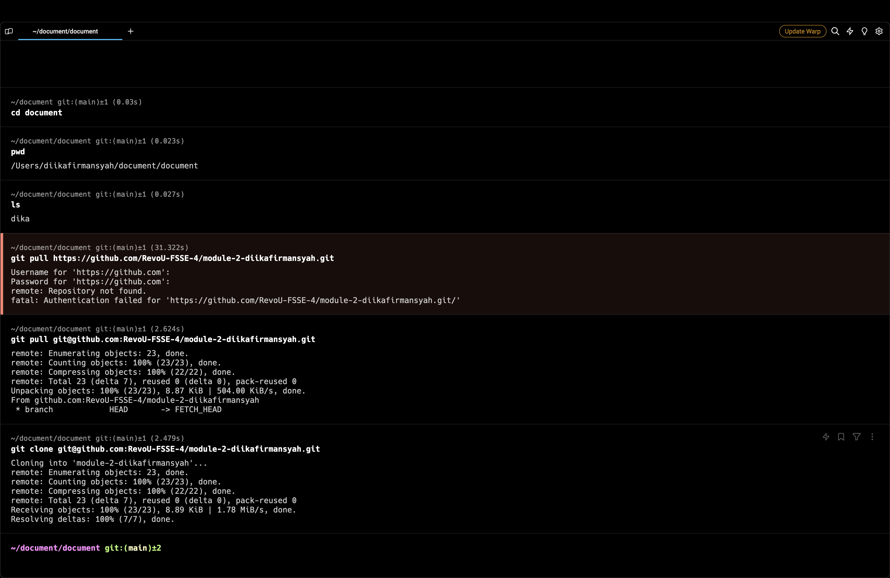

# About alien

# In 2040, Americans plan to vote in a U.S. presidential election.
            Japan promises to stop using nuclear power. Britain’s Prince George
            will turn the ripe age of 27. And, as the interactive above
            demonstrates, the world is likely to find alien life. It could
            happen even sooner, depending how many civilizations are out there
            to be found. To understand why this is, it helps to know about
            someone name Frank Drake.Drake is the least lonely man on Earth—if
            not in the entire galaxy. Most of us are reserving judgment on
            whether there is intelligent life on other planets; we haven’t even
            found bacteria yet, much less a race of aliens with Internet service
            and takeout food. But Drake, an astrophysicist and chairman emeritus
            of the California-based SETI (Search for Extraterrestrial
            Intelligence) Institute, has no such doubts. It was in 1961, when he
            was working at the National Radio Astronomy Observatory in Green
            Bank, W. Va., that Drake developed the eponymous—and now
            famous—Drake Equation, which calculates how many advanced and
            detectable civilizations there should be in the Milky Way in any one
            year. The number turns out to be potentially huge, and while it’s
            admittedly based on a number of Earth-centric suppositions—the
            collapse of any one of which calls much of the equation into
            question—all of those suppositions are based in increasingly solid
            science.Start with the number of stars in our galaxy, which is
            conservatively estimated at 100 billion, though is often cited as
            three times that. Of those 100 billion, from 20% to 50% probably
            harbor planetary systems—an estimate that becomes more and more
            reliable as the Kepler Space Telescope and various ground-based
            observatories detect increasing numbers of exoplanets. Not all of
            those exoplanets would be capable of sustaining Earth-like life, so
            the equation assumes from 1 to 5 in any system could. Of those
            bio-friendly worlds, from 0% to 100% would actually go on to develop
            life. And of those world, in turn, from 0% to 100% would develop
            life forms that we would consider intelligent. Not all of those
            exoplanets would be capable of sustaining Earth-like life, so the
            equation assumes from 1 to 5 in any system could. Of those
            bio-friendly worlds, from 0% to 100% would actually go on to develop
            life. And of those world, in turn, from 0% to 100% would develop
            life forms that we would consider intelligent.

# this web created using :
- HTML
- CSS

# image source :
- google image

# image documentation 
- for deployment 
- for domain 
- for deployment in netlify 

